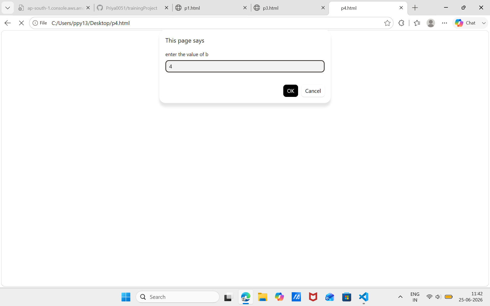

JavaScript Practice

This repository contains my JavaScript practice programs created while learning JavaScript basics.

Topics Covered

- Variables and Data Types
- Arrays
- Objects
- Loops
- Basic JavaScript Operations
- Document Write and Console Output

Files

- p1.html
- p2.html
- p3.html
- p4.html
- p5.html
- p6.html
- p7.html

Purpose

This repository is created for practice and learning JavaScript fundamentals.
## Output Screenshot
