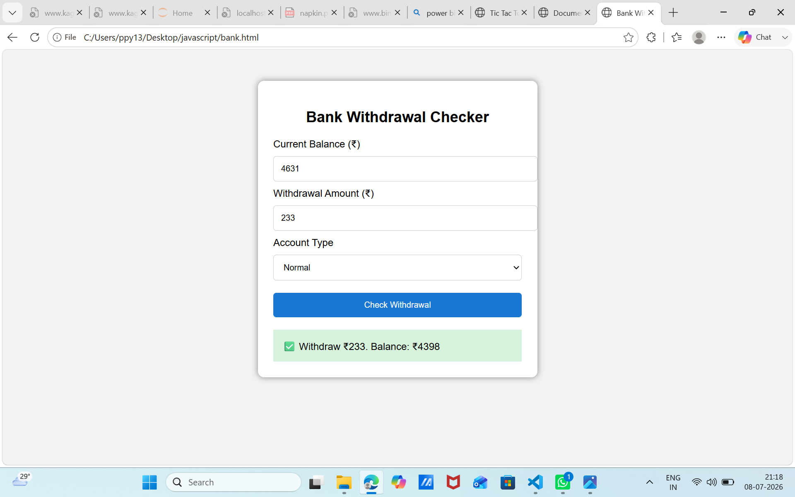
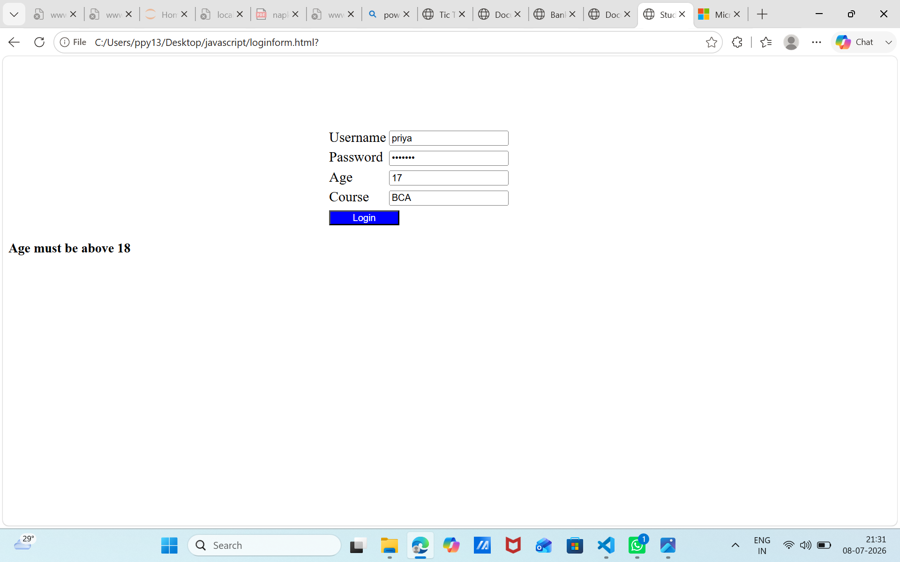
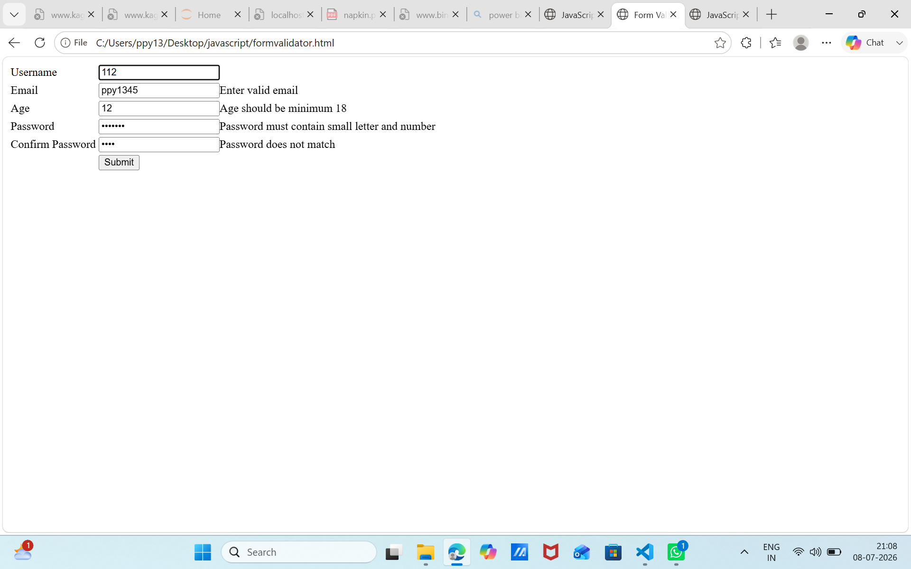
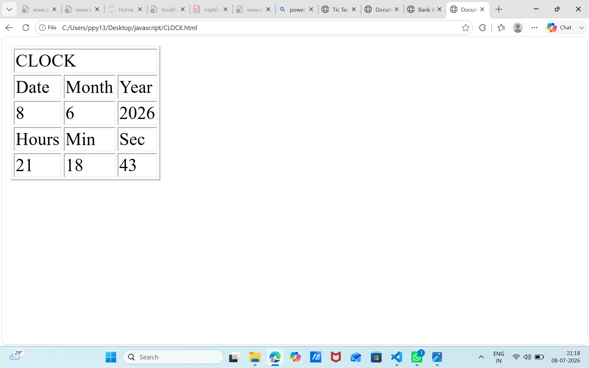
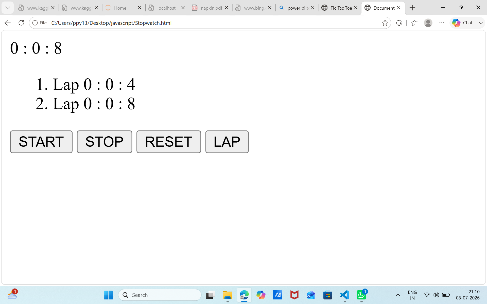
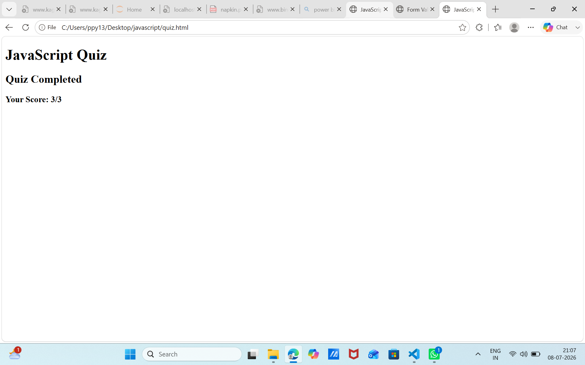
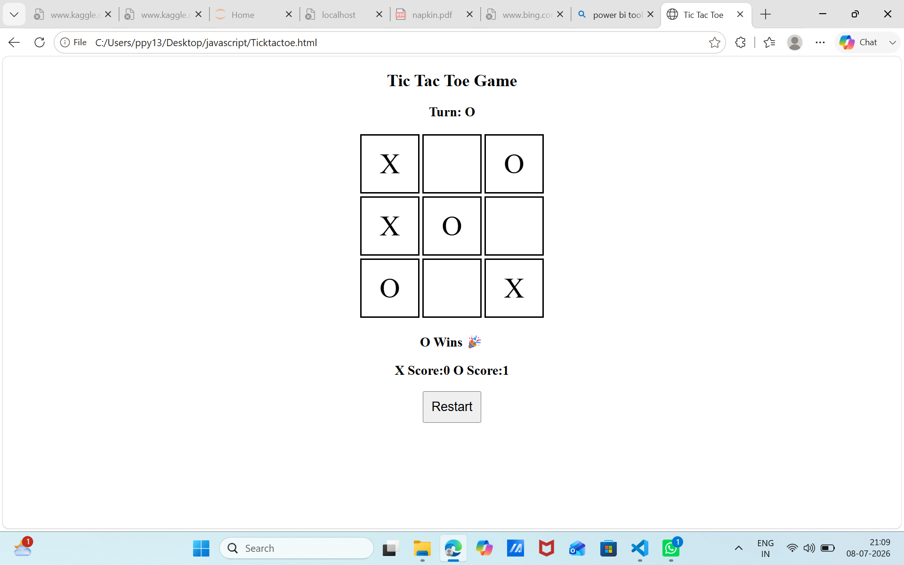

# JavaScript Projects Collection

## Overview
This repository contains my JavaScript practice programs and mini projects developed during my learning journey. These projects helped me strengthen my understanding of JavaScript fundamentals, DOM manipulation, form validation, timers, and interactive web development.

## Projects Included

### JavaScript Practice Programs
- P1 – P20 JavaScript Programs

### Mini Projects
- Banking Operations (Deposit, Withdraw & Balance Check)
- Login Form
- Form Validation using jQuery Validation Plugin
- Digital Clock
- Stopwatch
- Quiz Application
- Tic Tac Toe Game

## Technologies Used
- HTML5
- CSS3
- JavaScript (ES6)
- jQuery
- jQuery Validation Plugin

## Folder Structure

```text
javascript/
│── screenshots/
│── bank.html
│── CLOCK.html
│── formvalidator.html
│── login.html
│── loginform.html
│── p1.html
│── p2.html
│── p3.html
│── p4.html
│── p5.html
│── p6.html
│── p7.html
│── p8.html
│── p9.html
│── p10.html
│── p11.html
│── p12.html
│── p13.html
│── p14.html
│── p15.html
│── p16.html
│── p17.html
│── p18.html
│── p19.html
│── p20.html
│── quiz.html
│── stopwatch.html
│── tictactoe.html
│── README.md
```

## Learning Outcomes
- JavaScript Fundamentals
- DOM Manipulation
- Event Handling
- Form Validation
- Timers and Clock
- Game Development
- Problem Solving
- Interactive Web Development

##  Project Outputs

###  Banking Operations


###  Login Form


### Form Validation


###  Digital Clock


### ⏱ Stopwatch


### Quiz Application


### Tic Tac Toe Game



*Learning JavaScript through practice, projects, and continuous improvement.* 